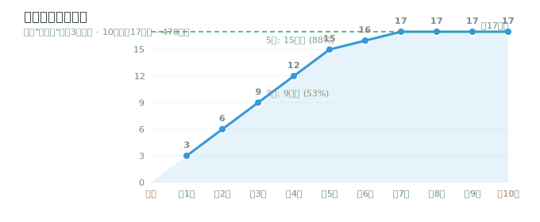
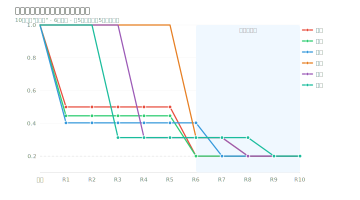
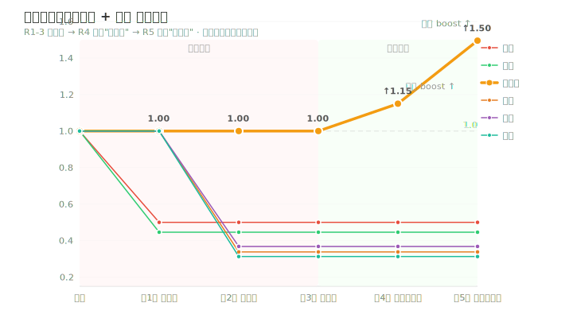
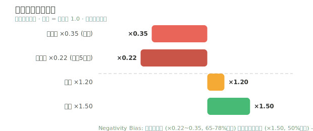

# Algorithm Design

> Complete design documentation, validation data, and convergence analysis for the Forkcast recommendation engine.

Forkcast's recommendation algorithm is grounded in four peer-reviewed cognitive psychology theories:

| Theory | Application |
|:---|:---|
| **Elimination by Aspects** (Tversky, 1972) | Non-compensatory two-stage decision model — eliminate then refine |
| **Negativity Bias** (Baumeister et al., 2001) | Rejection feedback doubles penalty weight for faster convergence |
| **Information Foraging** (Pirolli & Card, 1999) | Three-card patch strategy maximizes information density |
| **Affective Forecasting** (Wilson & Gilbert, 2003) | Mood / time / seasonal consistency in preference modeling |

---

## Signal System

Three-tier asymmetric feedback signals, rigorously aligned with cognitive psychology theory:

| Action | Signal Strength | Short-Term Weight Change | Meaning |
|------|---------|-------------|------|
| Skip | Negative | ×0.35 → ×0.22 (escalating) | "None of these 3 appeal" |
| Backup ⭐ | Weak Positive | ×1.2 | "Maybe — save for later" |
| Pick ❤️ | Strong Positive | ×1.5 | "I want this one" |

> Users arrive with preferences; the system converges within 3-5 rounds through elimination-based decision making. For pure browsing, use the Menu page instead.

---

## Convergence Validation

### Cuisine Space Exploration Progress

Tracking 10 rounds of algorithm execution with 470 dishes, 17 cuisines, starting at 12:00 PM:



```
Rounds 1-5 (First Scan):   Diversity mechanism ensures 3 new cuisines explored per round
                           → 5 rounds cover 15/17 cuisines (88%)
Rounds 6-10 (Re-hit):      Cuisines exhausted; penalized cuisines reappear
                           → Secondary weight drop → hits floor at 0.2 per round
```

### Pure Skip Convergence Curve

All 10 rounds are "skip" — showing weight changes across 6 major cuisines. The first 5 rounds scan different cuisines; from round 6, cuisines are re-hit with secondary drops:



### Mixed Operations: Backup + Pick

Simulating real user behavior: first 3 rounds explore via skip → round 4 backup "Home-style" → round 5 pick "Home-style". Shows how preferred cuisines rise above others when positive feedback is given:



### Feedback Signal Strength Comparison

Short-term weight multiplier comparison, demonstrating Negativity Bias — rejection penalties far outweigh selection rewards:



---

## Key Design Self-Check

- **No same-cuisine clustering** — Three-slot strategy (Safe/Familiar/Novel) + cuisine diversity weight 0.5
- **Skip won't over-penalize a single cuisine** — Each round's 3 dishes are distributed across different cuisines; penalties spread evenly
- **Consecutive rejection escalation is directionally correct** — Uses division formula `×0.35 / escalation` for increasing penalty on consecutive rejects
- **`season-all` tag works** — 364 all-season dishes receive context bonuses in any season
- **Elimination takes priority over selection** — Reject penalty (×0.22~0.35) far outweighs pick reward (×1.5)

---

## Technical Architecture

```
┌─────────────────────────────────────────────┐
│            Recommendation Engine            │
├─────────────────────────────────────────────┤
│  Tag Weight Scoring + Diversity Algorithm   │
│  Time Decay + Context Bonuses               │
│  Asymmetric Feedback (Reject >> Pick)       │
│  Three-Slot Strategy (Safe/Familiar/Novel)  │
├─────────────────────────────────────────────┤
│            Storage & Monitoring             │
├─────────────────────────────────────────────┤
│  Zustand (5 Slice Modular State)            │
│  LocalStorage Persist (Client-Side Only)    │
│  Tuning Constants → src/store/constants.ts  │
│  Chart Scripts → scripts/generate-charts.cjs│
└─────────────────────────────────────────────┘
```

### Tuning Guide

All algorithm hyperparameters are centralized in `src/store/constants.ts`. After changes, run `node scripts/generate-charts.cjs` to regenerate validation charts.

| Parameter | Default | Description |
|------|--------|------|
| `REJECT_SHORT_PENALTY` | 0.35 | Single reject short-term penalty multiplier |
| `CUISINE_REJECT_SHORT_PENALTY` | 0.50 | Cuisine-level reject penalty multiplier |
| `PICK_SHORT_BOOST` | 1.50 | Pick short-term reward multiplier |
| `BACKUP_SHORT_BOOST` | 1.20 | Backup short-term reward multiplier |
| `CONSECUTIVE_REJECT_FACTOR` | 0.12 | Consecutive reject escalation factor |
| `CONTEXT_BONUS_TIME` | 1.30 | Time-of-day context bonus |
| `CONTEXT_BONUS_SEASON` | 1.15 | Season context bonus |
